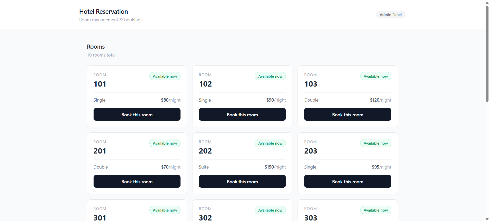
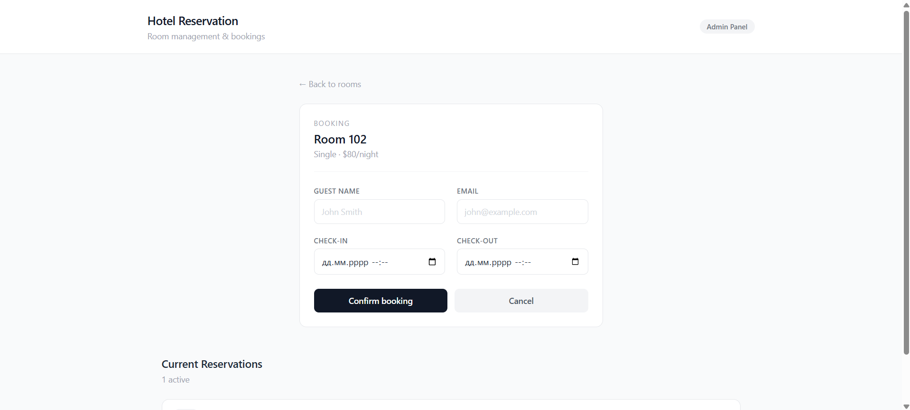
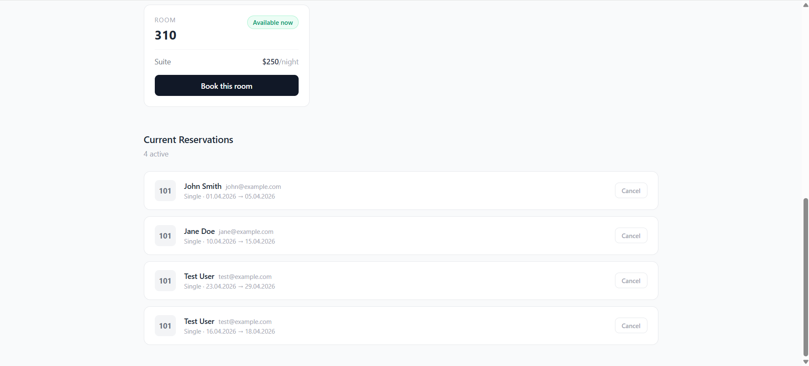

# Hotel Frontend

React frontend for the Hotel Reservation System.

## Tech Stack

- React 18
- Tailwind CSS 3

## Getting Started

### Prerequisites

- [Node.js](https://nodejs.org) v14 or higher
- HotelApi backend running on `http://localhost:5138`

### Run locally
```bash
git clone <your-repo-url>
cd hotel-frontend
npm install
npm start
```

App will be available at `http://localhost:3000`

## Project Structure
```
hotel-frontend/
├── public/
│   └── index.html
└── src/
    ├── components/
    │   ├── RoomList.jsx        # Room grid with availability badges
    │   ├── ReservationForm.jsx # Booking form
    │   └── ReservationList.jsx # Active reservations with cancel
    ├── App.js
    ├── index.js
    └── index.css
```

## Features

- Room grid showing all rooms with live availability status
- Color-coded badges — green for available, red for reserved
- Booking form with guest name, email, check-in and check-out
- Error handling — displays API error messages inline (e.g. room already reserved)
- Active reservations list with cancel button
- Fully responsive layout

## Screenshot of the main page


## Screenshot of the register form 


## Screenshot of the current reservations

## Notes

- API base URL is hardcoded to `http://localhost:5138` — update in component files if deploying
